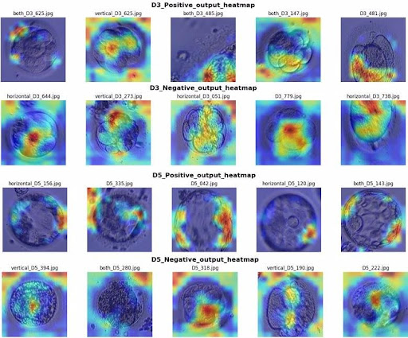
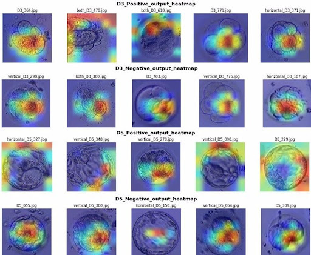
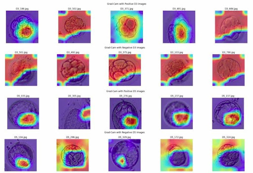
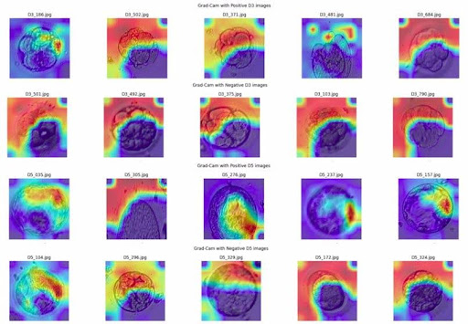

<div align="center">    
 
# Advancing Embryo Selection: A Comparative Study of State-of-the-Art Deep Learning Models for IVF Embryo Quality Assessment

by Duc Tran *, Phat Pham *, Anh Nguyen *, Hieu Vu *, and Lam Pham. 

\* equal contribution.
</div> 

**Official Implementation** _for the paper "Advancing Embryo Selection: A Comparative Study of State-of-the-Art Deep Learning Models for IVF Embryo Quality Assessment" (2022).
In this project, we implemented 4 models ResNet50, VGG19, EfficientNetB0 and MobileNet in classifying embryos based on their Inner cell mass (ICM) and trophectoderm (TE) cell characteristics from microscopic images._

## 1. Requirements
```
python=3.10.0
tensorfow=2.15.0
pip install tqdm
pip install seaborn
pip install matplotlib.pyplot
```

## 2. Download datasets and pretrained models
* Download dataset including [train dataset](https://drive.google.com/drive/folders/1PjbqQfP5SAfL5hvRxGJFfd1Lx7BqKIkP?usp=sharing), [validation dataset](https://drive.google.com/drive/folders/1WitdlpCLiU5d_EI8pYYPiUAut5zOgQZr?usp=sharing), [test dataset](https://drive.google.com/drive/folders/1Kzgktxv18shSKyhMoQKzD7RzOjmmMHg7?usp=sharing).  

* Replace the datapath in the notebook with your own downloaded dataset.

* The notebook is ready to run directly. You can train the model from scratch or refer to our model weights from [here]( https://drive.google.com/drive/folders/16zJAxbMP60m8rXofWHwSpgK9qd-s_8qL?usp=sharing) .(folder name "cuoc_thi_wcs2023_p2").

### 2.1. Visualize VGG-19 and ResNet50
Running on:

[Advancing_Embryo_Selection(2_Model_VGG_and_ResNet50).ipynb](Advancing_Embryo_Selection(2_Model_VGG_and_ResNet50).ipynb)

then we get:

<div align="center">  


 
#### Embryo images from VGG-19

</div> 


<div align="center">   

 
 
#### Embryo images from ResNet50

</div> 

### 2.1. Visualize EfficientNetB0
Running on:

[embryo-classification-efficientnetb0.ipynb](embryo-classification-efficientnetb0.ipynb)

then we get:

<div align="center">  
 

  
#### Embryo images from EfficientNetB0
</div> 

### 2.1. Visualize MobileNet
Running on:

[embryo-mobilenetv2.ipynb](embryo-mobilenetv2.ipynb)

then we get:

<div align="center"> 
 

  
#### Embryo images from MobileNet
</div> 

## 3. License
[MIT](LICENSE)
